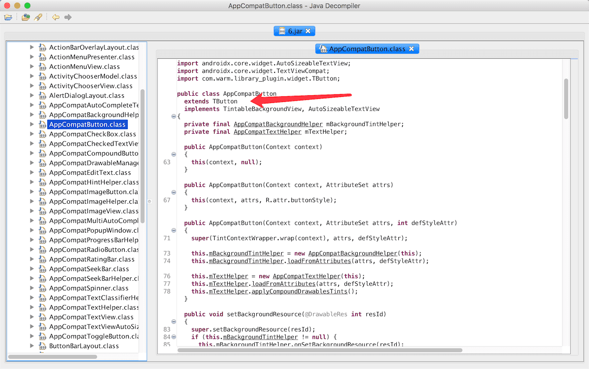

## 无痕埋点实现方案的初步尝试

本文主要讨论无痕埋点的无痕操作，**不涉及埋点存储，上传等问题**，比较适合项目中使用了友盟以及类似方案的小伙伴，[项目地址](<https://github.com/AWarmHug/TrackBoy>)。

#### 需求和解决方案分析

在做一个项目时，正常情况下，都会有埋点记录用户行为的需求，大多公司都会使用友盟或类似的方案进行代码埋点，在需要埋点的地方，调用相关的方法记录一下，在合适的时候进行上报，具体如何记录，如何上报由SDK决定，我们只需要关心如何在合适的地方加入类型如下的代码：

```java
public static void onEvent(Context context, String eventID);
public static void onEvent(Context context, String eventID, String label);
```

比较简单的方法就是在代码的各处手动加入埋点的操作，手动埋点虽然比较灵活简单，但就会存在如下几个问题：

1. 埋点代码和业务代码耦合太严重，可能所有点击的地方都需要加入埋点，需要大量重复操作，不够优雅。
2. 埋点容易出错且难以维护，每个版本都可能存在增删改埋点，一般都会面对一个Excel表格，一改改半天，过两天要发布了，产品又发来一个表格，埋点需要轻微的修改。
3. 埋点一旦上线后就无法增减或修改。

针对上面几个问题，我们逐一寻找解决方案：

1. 代码耦合问题：

   * 通过设置View.AccessibilityDelegate或者直接反射替换点击事件。
   * 通过AOP的方式，针对需要埋点的事件、方法等，插入埋点相关的代码。
   * 将控件直接替换为我们自己的控件，在控件内部进行埋点

2. 维护问题：

   我们针对需要埋点的控件，生成一个唯一标识，如：**Activity+层层布局ClassName+id**。通过id与和埋点内容建立一套映射关系，当需要触发埋点时，根据标识获取到内容，进行埋点。

3. 动态修改：

   这就比较简单了，在2的方案下，可以直接下发映射关系到APP中，可以加入版本的概念，毕竟埋点本身并不会经常修改。

#### 代码耦合问题的具体实现

1. ##### View.AccessibilityDelegate

   Android系统提供了View.AccessibilityDelegate来帮助视力，肢体残疾等用户来使用Android设备。

   可以查看**View.performClick()**源码：

   ```java
   	public boolean performClick() {
           final boolean result;
           final ListenerInfo li = mListenerInfo;
           if (li != null && li.mOnClickListener != null) {
               playSoundEffect(SoundEffectConstants.CLICK);
               li.mOnClickListener.onClick(this);
               result = true;
           } else {
               result = false;
           }
   
           sendAccessibilityEvent(AccessibilityEvent.TYPE_VIEW_CLICKED);
   
           notifyEnterOrExitForAutoFillIfNeeded(true);
   
           return result;
       }
   ```

   在点击之后，会调用 sendAccessibilityEvent(AccessibilityEvent.TYPE_VIEW_CLICKED)；

   ```java
   public void sendAccessibilityEvent(int eventType) {
           if (mAccessibilityDelegate != null) {
               mAccessibilityDelegate.sendAccessibilityEvent(this, eventType);
           } else {
               sendAccessibilityEventInternal(eventType);
           }
       }
   
   ```

   最后会调用AccessibilityDelegate.sendAccessibilityEvent(View host, int eventType)方法。我们自定义AccessibilityDelegate，在相关的方法中埋点。

   我们可以在Application的onCreate()方法中，通过application.registerActivityLifecycleCallback监听所有Activity的生命周期，遍历所有控件，设置AccessibilityDelegate，并给RootView注册 ViewTreeObserver.OnGlobalLayoutListener 监听器，在布局发生变化时，重新遍历控件设置AccessibilityDelegate。

   这个方案存在两个缺陷，1、无法给Dialog和PopupWindow埋点，2、需要多次遍历控件，影响 性能

2. ##### 反射

   我们查看View的源码可以发现，源码中有这样一个类```ListenerInfo ```，所有的事件都是存放在这个类中，我们可以写一个```View.OnClickListener```代理类，通过View.hasOnClickListeners()判断是否有点击事件，直接替换点击事件。具体代码如下：

   ```
   // hook一个View的监听器，替换成上面的代理监听器
   public void hookListener(View view) {  
       // 1. 反射调用View的getListenerInfo方法（API>=14），获得mListenerInfo对象
       Class viewClazz = Class.forName("android.view.View");
       Method getListenerInfoMethod = viewClazz.getDeclaredMethod("getListenerInfo");
       if (!getListenerInfoMethod.isAccessible()) {
           getListenerInfoMethod.setAccessible(true);
       }
       Object mListenerInfo = listenerInfoMethod.invoke(view);
   
       // 2. 然后从mListenerInfo中反射获取mOnClickListener对象
       Class listenerInfoClazz = Class.forName("android.view.View$ListenerInfo");
       Field onClickListenerField = listenerInfoClazz.getDeclaredField("mOnClickListener");
       if (!onClickListenerField.isAccessible()) {
           onClickListenerField.setAccessible(true);
       }
       View.OnClickListener mOnClickListener = (View.OnClickListener) onClickListenerField.get(mListenerInfo);
   
       // 3. 创建代理的点击监听器对象
       View.OnClickListener mOnClickListenerProxy = new OnClickListenerProxy(mOnClickListener);
   
       // 4. 把mListenerInfo的mOnClickListener设成新的onClickListenerProxy
       onClickListenerField.set(mListenerInfo, mOnClickListenerProxy);
       // 用这个似乎也可以：view.setOnClickListener(mOnClickListenerProxy);     
   }
   ```

   参考代码来自[点我达的一篇博客](http://tech.dianwoda.com/2019/04/02/1-zen-yao-qu-quan-ju-hook-viewde-shi-jian/)，这种方式也存在很明显的缺点，第一仍然需要循环所有控件，第二，何时进行替换，存在这样的情况：点击事件是网络请求之后再设置，那么这时候可能就会无法替换到，第三，存在一些控件通过performClick()来触发点击事件，而非OnClickListener，比如TabLayout。

3. ##### 通过AOP的方式插入埋点代码，这里主要介绍Aspectj在Android中的使用

   首先需要进行配置，原本想要使用AspectJ，需要[大量的配置](<https://fernandocejas.com/2014/08/03/aspect-oriented-programming-in-android/>)。当然也有简单的方法，这样可以直接使用沪江的[AspectJX](<https://github.com/HujiangTechnology/gradle_plugin_android_aspectjx>)，具体的配置方法见项目介绍。

   AspectJ具体的使用，可以查看网络上的一些资料，[这篇文章](<https://blog.csdn.net/zlmrche/article/details/79643801>)写的挺好。

   Aspectj有很多高深的写法，主要还是靠自己多写多尝试。这里我写了一个点击事件的埋点

   ```
   @Aspect
   public class ViewCore extends BaseCore {
   
       /**
        * 这是自定义注解的切点，如果在方法上加入了{@link Event},就认定是一个切点
        */
       @Pointcut("execution(@com.warm.someaop.annotation.Event * *(..))")
       public void method() {
   
       }
   
       /**
        * {@link android.view.View.OnClickListener#onClick(View)}的切点
     * 第二段为lambda的写法，
        * @param view
        */
       @Pointcut(value = "(execution(* android.view.View.OnClickListener.onClick(android.view.View))&&args(view))||(execution(void *..lambda*(android.view.View))&&args(view))")
       public void onClick(View view) {
   
       }
   
       /**
        * 具体的通知方法，当Pointcut中的方法被调用之后，触发该方法对一些信息进行拦截
        * @param joinPoint
        * @param view
        * @param obj
        * @throws Throwable
        */
       @After("onClick(view)&&!method()&&this(obj)")
       public void injectOnClick(JoinPoint joinPoint, View view,Object obj) throws Throwable {
           Trace trace = Data.getEvent(getName(joinPoint, view));
           if (trace != null) {
               track(trace.getId(), trace.getValue());
           }
       }
   
   
       private String getName(JoinPoint joinPoint, View view) {
   
           StringBuilder sb = new StringBuilder();
   
           sb.append(getViewName(view))
                   .append("$")
                   .append(getClassName(joinPoint.getTarget().getClass()))
                   .append("$")
                   .append(getClassName(view.getContext().getClass()));
   
           String md5 = Utils.toMD5(sb.toString());
   
           if (BuildConfig.DEBUG) {
               Log.d(TAG, "getName: " + sb.toString() + ",MD5: " + md5);
           }
   
           return md5;
       }
   
   }
   
   ```

   我们定义一个数据管理类，本项目中的**Data**，简单模拟了数据的存入和获取，在Application类中存入所有的埋点，实际项目中应该由网络直接下发。当我们拦截到点击事件后，从数据管理类中获取到埋点信息。这个方案也存在的一些问题：主要针对一些lambda表达式，并不能很好的拦截，比如：```this::onClick```这样的写法，就没办法统一拦截，只能单独写切点，需要我们在写代码时能统一一些格式，或者我们直接拦截setOnClickListener，将点击事件替换成我们自己的代理类，大致代码如下：

   ```java
   
       @Pointcut("call(* android.view.View.setOnClickListener(android.view.View.OnClickListener))&&args(clickListener)")
       public void setOnClickListener(View.OnClickListener clickListener) {
   
       }
   
       @Around("setOnClickListener(clickListener)")
       public Object injectSetOnClickListener(ProceedingJoinPoint joinPoint, View.OnClickListener clickListener) throws Throwable {
           return joinPoint.proceed(new Object[]{new OnClickListenerProxy(clickListener)});
       }
   
   ```

4. ##### 通过Gradle插件，将控件的父类直接修改为我们自己的控件

   该方案的思路来源于[美团的一篇博客](https://tech.meituan.com/2017/03/02/mt-mobile-analytics-practice.html)，我进行了实践和补充，这是我认为比较完善的方案。

   我们可以自定义一些常用控件，将所有的控件都直接继承自定义控件，在我们自己的控件中进行埋点操作，这样中，可以拦截到更多的事件，稳定且可靠，比如如下的TTextView：

   ```java
   public class TTextView extends TextView {
       public TTextView(Context context) {
           super(context);
       }
   
       public TTextView(Context context, AttributeSet attrs) {
           super(context, attrs);
       }
   
       public TTextView(Context context, AttributeSet attrs, int defStyleAttr) {
           super(context, attrs, defStyleAttr);
       }
   
       @Override
       public boolean performClick() {
           boolean click = super.performClick();
           Track.getTrack().getViewTracker().performClick(this);
           return click;
       }
   }
   ```

   我们在performClick()中进行埋点，任何点击事件，都必然会走这个方法，我们不必担心OnClickListener问题

   我们目前的开发基本都会添加Support包，并继承```AppCompatActivity```，我们在XML中使用的控件都会自动换成Appcompat**控件，V7包通过AppCompatViewInflater来进行转换，我们可以关注一下`AppCompatDelegateImpl#createView`方法：

   ```
       @Override
       public View createView(View parent, final String name, @NonNull Context context,
               @NonNull AttributeSet attrs) {
           if (mAppCompatViewInflater == null) {
               TypedArray a = mContext.obtainStyledAttributes(R.styleable.AppCompatTheme);
               String viewInflaterClassName =
                       a.getString(R.styleable.AppCompatTheme_viewInflaterClass);
               if ((viewInflaterClassName == null)
                       || AppCompatViewInflater.class.getName().equals(viewInflaterClassName)) {
                   // Either default class name or set explicitly to null. In both cases
                   // create the base inflater (no reflection)
                   mAppCompatViewInflater = new AppCompatViewInflater();
               } else {
                   try {
                       Class viewInflaterClass = Class.forName(viewInflaterClassName);
                       mAppCompatViewInflater =
                               (AppCompatViewInflater) viewInflaterClass.getDeclaredConstructor()
                                       .newInstance();
                   } catch (Throwable t) {
                       Log.i(TAG, "Failed to instantiate custom view inflater "
                               + viewInflaterClassName + ". Falling back to default.", t);
                       mAppCompatViewInflater = new AppCompatViewInflater();
                   }
               }
           }
   
           boolean inheritContext = false;
           if (IS_PRE_LOLLIPOP) {
               inheritContext = (attrs instanceof XmlPullParser)
                       // If we have a XmlPullParser, we can detect where we are in the layout
                       ? ((XmlPullParser) attrs).getDepth() > 1
                       // Otherwise we have to use the old heuristic
                       : shouldInheritContext((ViewParent) parent);
           }
   
           return mAppCompatViewInflater.createView(parent, name, context, attrs, inheritContext,
                   IS_PRE_LOLLIPOP, /* Only read android:theme pre-L (L+ handles this anyway) */
                   true, /* Read read app:theme as a fallback at all times for legacy reasons */
                   VectorEnabledTintResources.shouldBeUsed() /* Only tint wrap the context if enabled */
           );
       }
   ```

   通过该方法我们得知，可以再Theme中设置AppCompatViewInflater，我们可以自定义TAppCompatViewInflater，替换成我们自己的控件。但是第三方库中的控件，我们自定义的控件，就会失效，所以，我们需要写一个[插件](buildsrc)，在编译时，将会打印，转换后的jar包路径，
   
   将控件的父类修改成我们自定义的控件。我们可以查看修改后的代码，生成的路径为：**app/build/intermediates/transforms/TrackTransform/debug**，使用JD-GUI打开，我们可以看到：
   
   我给插件写了一个extension，可以排除不需要转换的包：
   
   ```groovy
   track {
       excludes = [
               "retrofit2","com/umeng/"
       ]
   }
   ```
   
   通过这样的方式，可以将所有的控件转换成自定义的控件，但是仍然还有一些缺陷，比如我们很多时候需要在代码中动态添加控件，可以调用addView()的方法，传入需要加入的控件，我们可能会存在new LinearLayout()或new Button()这种情况，我们还是不能转换，但是我们可以结合第一种方案，在ViewGroup.addView时，设置View.AccessibilityDelegate，这样既不就覆盖了所有的情况
   
   ```java
   @Override
   public void onViewAdded(View child) {
       super.onViewAdded(child);
       AccessibilityDelegateHelper.onViewAdded(child);
   }
   ```

#### 唯一标识和映射关系的具体实现

唯一标识的规则基本都是设计一个ViewPath，类似Activity+层层布局id这种，可以看看[51信用卡这一篇文章](<https://juejin.im/post/5c6fab38f265da2dd05242ea>)，[网易HubbleData](<https://mp.weixin.qq.com/s/0dHKu5QIBL_4S7Tum-qW2Q>) ，文中讲的也很清楚，主要是id和idEntryName的选择，index的优化以及特殊控件的优化，网上的文章基本千篇一律，大家的方案都是类似的，本项目也是如此。但是在生成ViewPath这个问题上，我们需要根据项目的实际情况，来生成符合项目ViewPath，下面介绍两种常见情况：

1. 针对使用了类似友盟的埋点上传机制<font size=2>(本文针对的主要情况)</font>，生成的ViewPath都需要后台配置下发到APP中。针对这种情况，布局index一般是不需要加入到ViewPath中的，因为该方案都是针对固定的点位，那些需要动态添加的view或者ListView、RecyclerView中的点位，具体item是多少个，其实后台也是不知道的，我们不可能配置100个1000个埋点，我这边考虑父布局需要给子控件添加index的手动添加一下tag或者再建立一套映射关系专门映射父布局用以区分。

2. 还有一些埋点上传方案是将所有的控件点击事件都上传后台，由后台来捞有效的埋点，这种方案加入index还是有必要的，毕竟后台可以控制哪些需要index，哪些不需要，APP只管上传点位信息就行，也就是**全埋点**的方案，这样的方案缺点主要是浪费流量，针对性不强。

不论什么样的方案，无痕埋点都需要多维护点位，每次页面发生修改，可能都需要后台维护一下埋点。